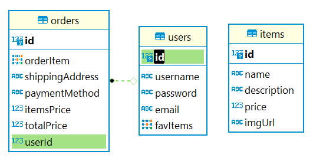

# shoppingServer

Express server

# [live](https://shoppingserver-production.up.railway.app/)

# DB-ERD

# REST API
## item routes
- POST /item :Create a new item.

- GET /item : Get all items

- DELETE /item/:id :delet an item.

- PUT /item/:id :update item

## order routes
- POST /order :Create a new order.

- GET /order : Get all orders

- DELETE /order/:id :delet an order.

- PUT /order/:id :update order

# Auth Routes

/signup

/signin

